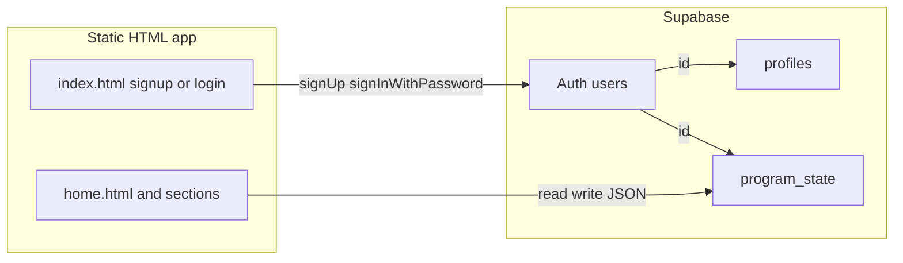

# Supabase sign-in, profiles, and shared-readable program data

## What you are building

- **Auth** (`auth.users`): Supabase stores email, password hash, and a stable **`user.id`** (UUID). That id is the key for “this person.”
- **Profile** (`profiles`): Extra columns you want to show or use everywhere (e.g. `full_name` from your form). One row per user, same `id` as `auth.users.id`.
- **Program inputs** (`program_state` or similar): One row per user holding a **JSON document** of everything you save from the app (wheel entries, schedule text, future sections). Easiest for a multi-page static site without dozens of tables.

You chose **email + password** and **any logged-in user may read other users’ saved data** (still not public to anonymous visitors—only to signed-in users).

---

## Part 1 — Supabase dashboard (no repo yet)

1. **Create / open the project** and note **Project URL** and **anon public** key (Settings → API).
2. **Authentication → URL configuration**: add your real site origin(s) (e.g. `https://yourdomain.com` and `http://localhost:PORT` for local testing) under **Site URL** and **Redirect URLs** so email links and OAuth work when you add them later.
3. **Authentication → Providers**: ensure **Email** is enabled. Decide whether **Confirm email** is required; if on, users must verify before `signIn` works—fine for production, sometimes turned off briefly while learning.

---

## Part 2 — Database: tables and RLS

Run in **SQL Editor** (or save as a migration if you use the Supabase CLI later).

**`profiles`**

- `id uuid primary key references auth.users (id) on delete cascade`
- `full_name text` (from signup)
- `created_at timestamptz default now()`
- Optional: trigger **on `auth.users` insert** to auto-create a profile row, *or* insert from the client right after `signUp` (simpler to start: client upsert after signup).

**`program_state`** (name is arbitrary)

- `user_id uuid primary key references auth.users (id) on delete cascade`
- `payload jsonb not null default '{}'::jsonb` — shape like `{ "section4": { "entries": [...] }, "section7": { "schedule": "..." } }`
- `updated_at timestamptz default now()` with a trigger to bump on update (optional but nice)

**Enable RLS** on both tables.

**Policies (match your visibility choice)**

| Table | Policy intent |
|--------|----------------|
| `profiles` | **SELECT**: `to authenticated` **using (true)** — any signed-in user can read all profiles. **INSERT/UPDATE**: only **`auth.uid() = id`**. |
| `program_state` | **SELECT**: `to authenticated` **using (true)** — any signed-in user can read all rows. **INSERT**: **`auth.uid() = user_id`**. **UPDATE**: **`auth.uid() = user_id`**. **DELETE** (if needed): **`auth.uid() = user_id`**. |

This gives **social read** while preventing users from editing someone else’s `payload`.

**Why not use the service role in the browser:** never. The **anon** key + RLS is the correct pattern.

---

## Part 3 — Frontend: load Supabase and one client module

- Add the Supabase JS client (CDN script tag on pages that need it, or a small bundled script—your call).
- Add a dedicated init file, e.g. [`project-shared.js`](c:\Users\JAGri\OneDrive - University of Tennessee\Sites 26\public utility\project-shared.js) extended or a new [`supabase-client.js`](c:\Users\JAGri\OneDrive - University of Tennessee\Sites 26\public utility\supabase-client.js), that:
  - calls `createClient(SUPABASE_URL, SUPABASE_ANON_KEY)`
  - exposes `window.PublicUtility.supabase` (or similar) for inline scripts on each HTML page

Store **only** the anon key in static files.

---

## Part 4 — Replace the current “fake” signup gate

Today [`index.html`](c:\Users\JAGri\OneDrive - University of Tennessee\Sites 26\public utility\index.html) only sets `localStorage` and [`home.html`](c:\Users\JAGri\OneDrive - University of Tennessee\Sites 26\public utility\home.html) checks that flag.

Planned behavior:

1. **Signup form**: add **password** (and **confirm password** in UI; compare in JS before calling API).
2. On submit: `supabase.auth.signUp({ email, password, options: { data: { full_name } } })`.
3. On success: **upsert** `profiles` with `{ id: user.id, full_name }`, then **upsert** `program_state` with `{ user_id: user.id, payload: {} }` if you want a row to always exist (or create lazily on first save).
4. Redirect to `home.html`.
5. **Existing users**: add a **“Already have an account?”** path on the same page or a small `login.html` that calls `signInWithPassword({ email, password })` then redirects to `home.html`.

Replace the home gate: **require a valid session** via `getSession()` / `onAuthStateChange`; if no session, redirect to `index.html` (or login). You can remove or repurpose `public-utility:signup-complete` once Auth is the source of truth.

---

## Part 5 — Persist and reload “program inputs”

**Load once after login (e.g. on `home.html` or a tiny shared bootstrap script included on every section):**

- `select payload from program_state where user_id = session.user.id` (single row).
- Keep a copy in **`sessionStorage` or an in-memory `PublicUtility.programPayload`** updated on each change so sections don’t all hammer the DB on every keystroke (optional debounced `update`).

**Save:**

- On meaningful events (confirm wheel in [`section4.html`](c:\Users\JAGri\OneDrive - University of Tennessee\Sites 26\public utility\section4.html), blur/confirm on [`section7.html`](c:\Users\JAGri\OneDrive - University of Tennessee\Sites 26\public utility\section7.html)), merge into `payload`, then:
  - `update program_state set payload = $1, updated_at = now() where user_id = auth.uid()`  
  - RLS ensures only the owner can write.

**Hydrate UI on each section page load:** read from cached payload or fetch row again and apply to `entries`, textarea, etc.

**“Others can see it”:** from any page, you can `select * from program_state` or join `profiles` — RLS **SELECT (true)** for authenticated users allows listing. Build a simple **directory or leaderboard page** later that renders other users’ `full_name` + chosen fields from `payload` (be careful: you are exposing full JSON to every logged-in user).

---

## Part 6 — Security and product caveats

- **Password signup** on a static site is standard with Supabase; enforce minimum password length in the UI.
- Because **all authenticated users can read full `payload`**, do not put secrets, health data, or anything sensitive there unless you add a stricter policy later.
- **Rate limiting / abuse**: consider Supabase Auth rate limits and CAPTCHA later if the app is public.

---

## Suggested implementation order

1. SQL: `profiles`, `program_state`, RLS policies (test in SQL Editor with a manual insert as a user if possible).
2. `supabase-client.js` + include on `index.html`, `home.html`, and sections that save data.
3. `index.html`: password fields + `signUp` + profile upsert + redirect; add login path.
4. `home.html`: session guard instead of localStorage-only gate.
5. **One pilot section** (e.g. section4 wheel): load `payload.section4` on init, save on confirm; verify in Table Editor.
6. Repeat for other inputs; add a minimal “browse others’ data” page if you want that UX.
